# [Manifest-declared receivers](https://developer.android.google.cn/guide/components/broadcasts?hl=en#manifest-declared-receivers)

**tips**：当不确定方法参数时，按住 Ctrl 键并单击该方法可以进入该方法，查看方法的构造

**说明**：这是实现一个 Manifest-declared receivers 例子的编码步骤

**具体实现**：

1. 定义广播 broadcast 发送广播
2. 定义广播接收器接受广播并在 AndroidManifest.xml 文件中注册，定义的广播接收器类要继承 BroadcastReceiver 抽象类
3. 在两者间传递消息

[TOC]


## 1. 新建一个Project

[TOC]


1. 依次点击 File/New/New Project，然后选择 Project Template，我们选择 Empty Activity，然后next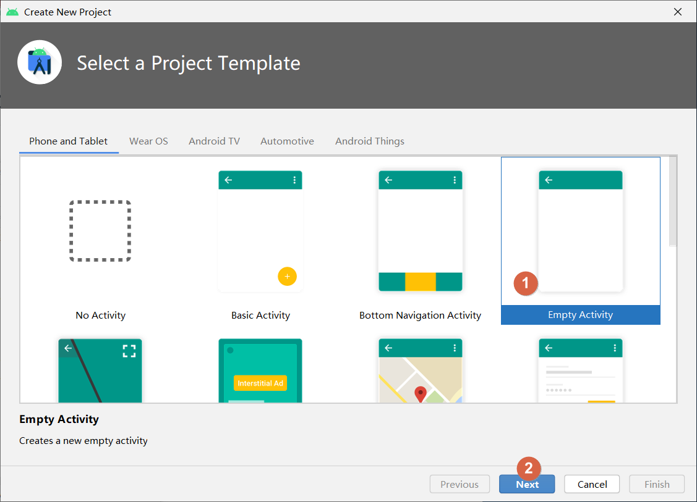
2. 填写 Project Name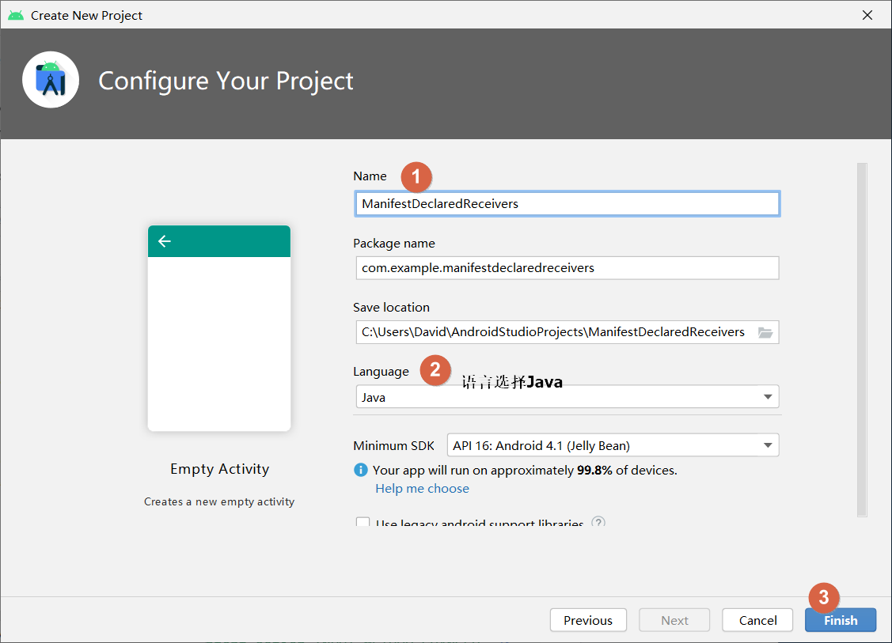
3. Project 新建完成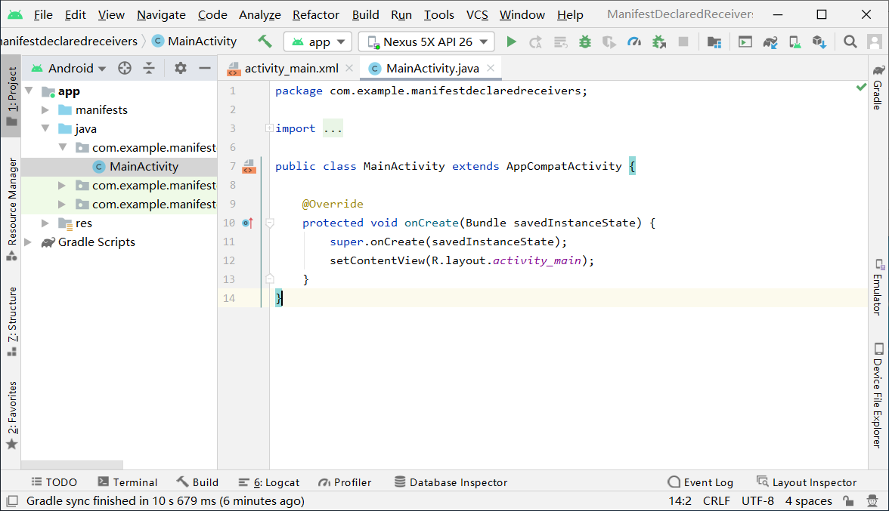
4. 


## 2. 定义 broadcast receiver

[TOC]


1. 在与 MainActivity 同一个包下新建一个 Java 类 MyReceiver，用作 broadcastReceiver，选中包名并右键该包名选择 New/Java Class，然后输入类名 MyReceiver，之后按回车键或双击 Class

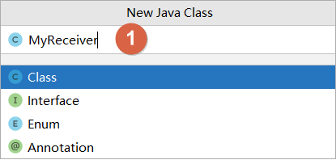

2. 新建结果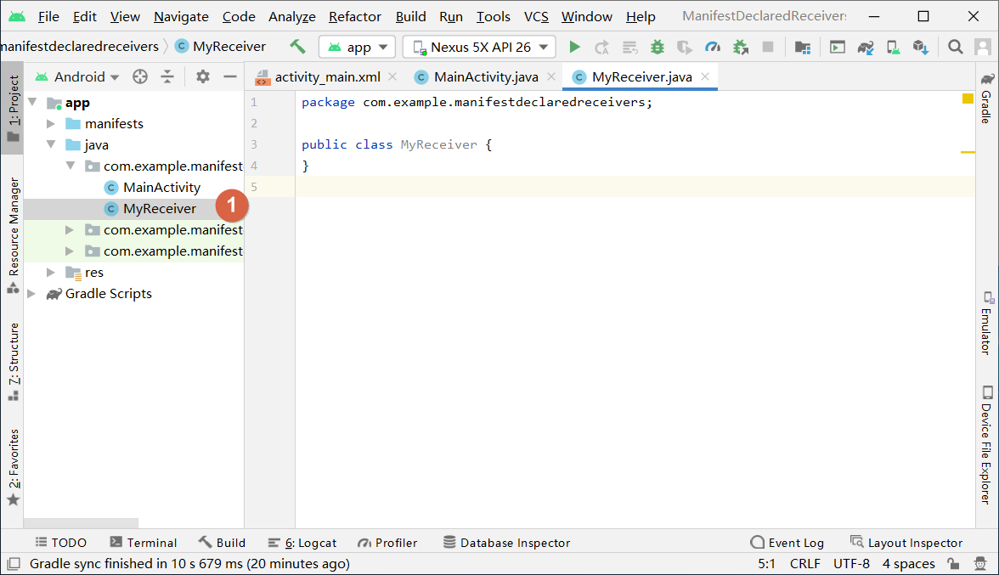
3. 继承 抽象类 BroadcastReceiver，将鼠标放到红色波浪线上会弹出提示，根据提示得知要实现 implements 抽象方法，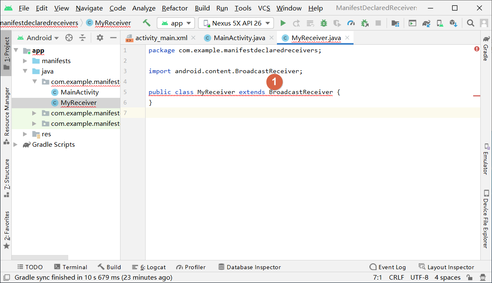
4. 实现抽象方法 onReceive 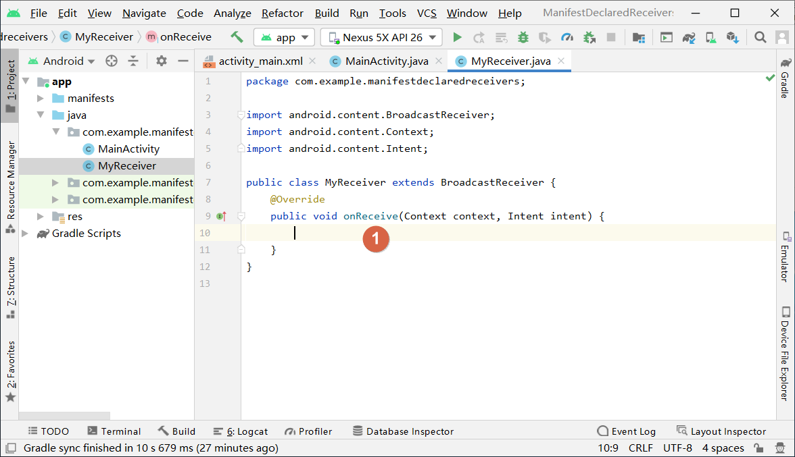

## 3. 注册 broadcastReceiver

[TOC]

1. 在 AndroidManifast.xml 清单文件中注册 broadcastReceiver，使用标签 <receiver>，属性 android.name 是必须的，其属性值是 broadcastReceiver 的类名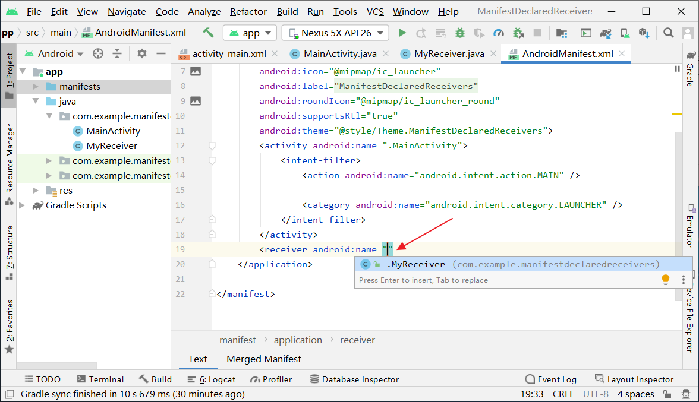

2. 填入类名并设置过滤器 <intent-filter>，用于匹配广播接收器，即若意图 intent 中设置了 action 且 其action 的名字与广播接收器的 action 的名字相同，该广播接收器就会响应意图 intent 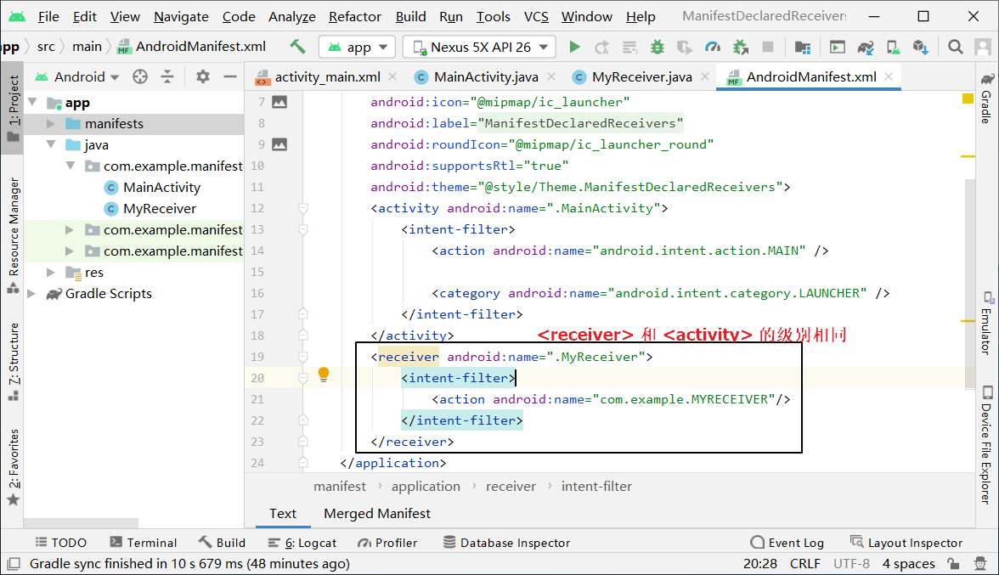

   ```xml
           <receiver android:name=".MyReceiver">
               <intent-filter>
                   <action android:name="com.example.MYRECEIVER"/>
               </intent-filter>
           </receiver>
   ```

3. 设置一下被用作广播发生者的 xml 文件，预览如下：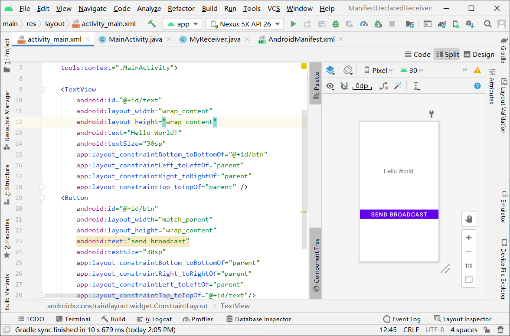

4. 实现广播发送者 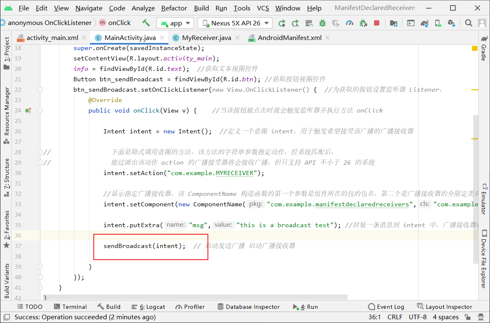

5. 实现广播接受者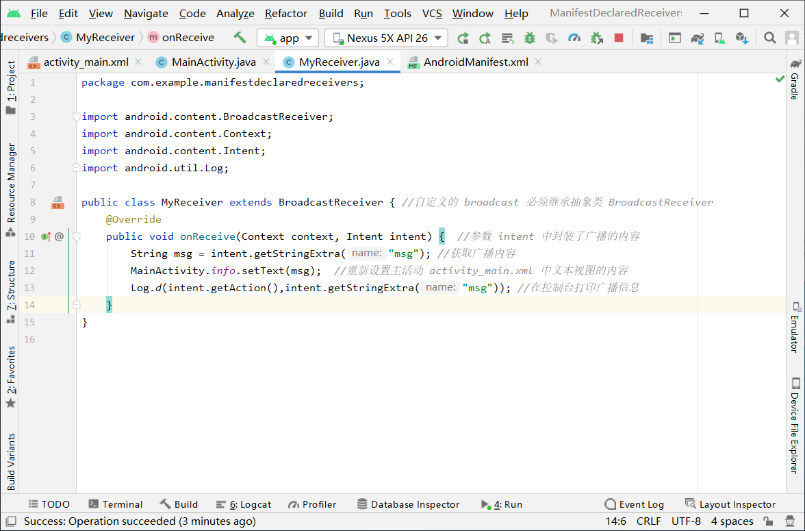

6. 结果演示

   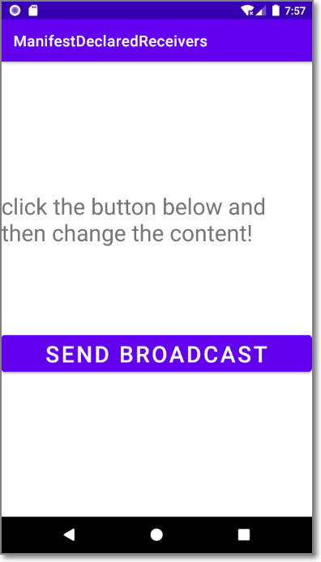

7. 广播接收器接收到消息后并重新设置主活动的内容

   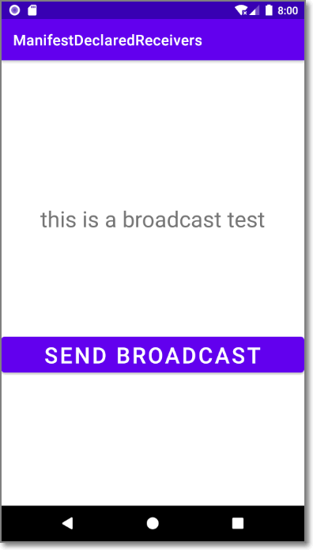

   

